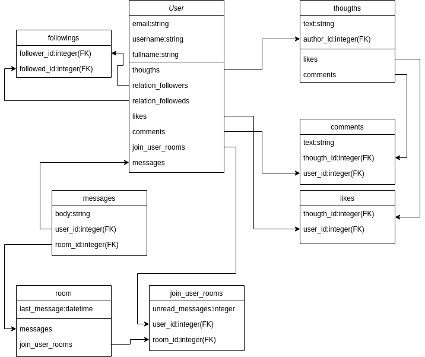
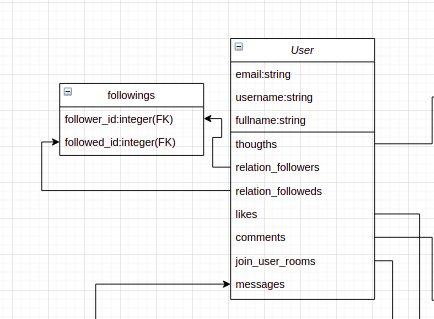
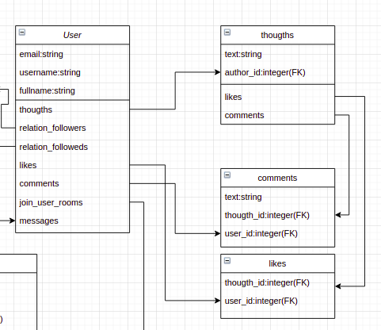
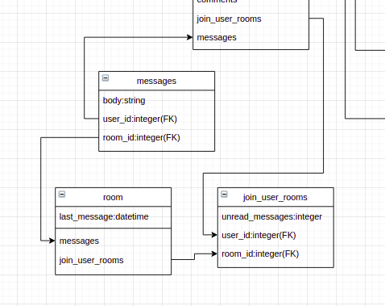

# Project Repository:
https://github.com/HADDADSOHAIB/let-learn
# Live link:
https://let-learn.herokuapp.com/

## Introduction:
Dans le cadre du projet final durant ma formation dans le bootcomp [Microverse](https/www. Microverseorg/), j'ai réalisé un clone simplifie de Twitter avec un système de communication texte en temps réel.

## Architecture:
La plateforme doit permettre aux utilisateurs de créer des idées (thougths), sur lesquelles on peut commenter (comments) et aimer(likes), les utilisateurs peuvent aussi suivre (follow) autre utilisateur et envoyer des messages (messages, rooms).

Pour arriver à ces objectif, l'architucture de la base de donnée suivant est adopté:  
https://drive.google.com/file/d/1bD-r-JkC48blAIxTjaPwHIK3TLJEudKq/view?usp=sharing

### Follow feature:
  
Pour permettre aux utilisateurs de suivre les autres utilisateurs, un tableau intermédiaire est créé pour gérer ça avec 2 éléments: follower id et followed id, l'objectif d'avoir ces 2 éléments est de donner un sens de direction, utilisateur 1 follow utilisateur 2 ne veut pas dire qu'utilisateur 2 follow utilisateur 1 aussi.

### Thougths, comment and likes:
  
Chaque utilisateur peut publier des idées (thougths), sur ces idées, on peut ajouter les commentaires(comments) et les aimer (likes), alors les tables comments et likes sont liés aux tables thougths et users.

### Messaging feature:
  
Un utilisateur peut créer des messages qui appartiennent aux chaines (rooms) spécifiques. une chaine peut avoir plusieurs utilisateurs (communication 1 à 1, communication du groupe) et un utilisateur peut être dans plusieurs chaines.
Pour chaque utilisateur, on a besoin d'afficher le nombre des messages n'est pas encore lit sur chaque chaine, alors on a mis cette information sur la table "join_user_room" vue qu'un record unique existe pour chaque combinaison d'utilisateur et chaine.

### choix de base de données:
La base de données utilisée dans cette application est Postgres. Le scope de ce projet est limité (projet de fin d'études), la plateforme ne sera pas mise à l'échelle (scaling), alors le choix d'une base de données SQL est faite vu que ça nous offre une interface simple pour faire des queries sur les données, et le choix de Postgres est faite vu que la solution est open source.

### Api
La communication entre le front et le back est faite avec un api REST. La structure de donnés est simple pour cette application (seules 8 tables), alors un choix comme graphql ne sera pas justifié.

### Real time messaging:
Pour assurer la communication en temps réel, la technique de web sockets est utilisé, le framework de Ruby On Rails fournit une solution intégrée (ActionCable) pour utiliser cette technique.
